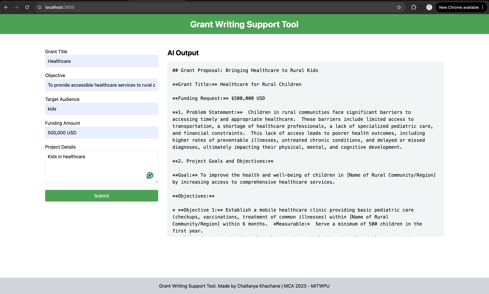

# Grant Writing Support Tool Documentation


## Features

### 1. User Interface Development
- Provides an intuitive and user-friendly interface for seamless access to grant writing resources.  
- Designed with accessibility and ease of use in mind.

### 2. FUTURE GOAL - Grant Proposal Assistance
- Assists users in drafting grant proposals via interactive Q&A sessions.  
- Supports text-based, voice-based, and file-based inputs for versatile user interactions.

### 3. Organization Profiling
- Builds detailed profiles of user organizations based on data inputs and interaction history.  
- Profiles include information such as mission, goals, target audience, and funding requirements.

### 4. FUTURE GOAL - Voice Note Processing
- Supports transcription of voice notes into text using AI, enabling efficient data capture and proposal generation.

---

## Technology Stack

### Frontend
- **React.js**: For building the interactive and responsive user interface.  
- **TailwindCSS**: For modern styling and layout design.

### Backend
- **Node.js** with **Express.js**: For handling API requests and server-side logic.

### AI Integration
- **Google Gemini API**: To generate tailored responses, process voice notes, and provide content for grant proposals.

### Additional Libraries
- **react-markdown**: For parsing and rendering markdown content.
- **dotenv**: For managing environment variables securely.
- **cors**: To enable cross-origin requests.

---

## Implementation

### 1. Interactive Proposal Assistance
- Users can input grant details (e.g., title, objectives, target audience, funding) via text, voice, or file uploads.
- The system processes user input and generates a comprehensive grant proposal using Gemini AI.

**Example Prompt:**



### 2. FUTURE GOAL -  Voice Note Processing
- Voice notes uploaded by users are transcribed into text using AI.
- The transcribed content is further processed to extract meaningful information for proposal drafting.


## How to Use

### 1. Run the Application
Clone the repository and install dependencies:

```bash
git clone https://github.com/chait04/Grant-Writing-Support-Tool.git
cd Grant-Writing-Support-Tool
npm install
```

### 2. Set Up Environment Variables
Create a `.env` file and add the Google API key:

```
GOOGLE_GENERATIVE_AI_API_KEY=your_api_key_here
```

### 3. Start the Backend Server
```bash
node server.js
```

### 4. Start the Frontend
```bash
npm start
```

## Folder Structure

```
Grant-Writing-Support-Tool/
│
├── backend/
│   ├── server.js             # Express.js server setup
│   └── .env                  # API keys and configuration
│
├── frontend/
│   ├── src/
│   │   ├── components/
│   │   │   ├── InputForm.js  # Input form for grant details
│   │   │   ├── OutputDisplay.js # Displays AI output
│   │   │   └── Body.js       # Main body component
│   │   ├── App.js            # Main React component
│   │   └── index.js          # Entry point for React
│   └── public/
│       └── index.html
│
├── package.json              # Project dependencies
└── README.md                 # Project documentation
```
